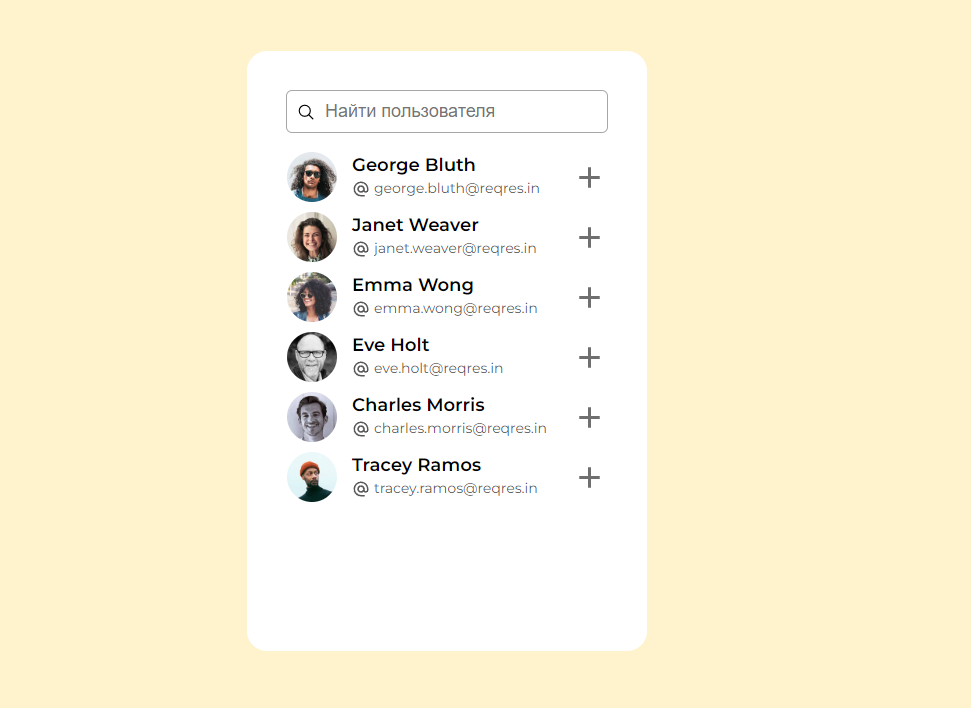

# Vue 3 user-invite

  

Application for filtration and inviting users

  

- Get users from API 'https://reqres.in/'

- Sort and add users

- Immitate sending an invetations


  



  

---


## Project Setup

```sh
npm install
```

### Compile and Hot-Reload for Development

```sh
npm run dev
```

### Type-Check, Compile and Minify for Production

```sh
npm run build
```
